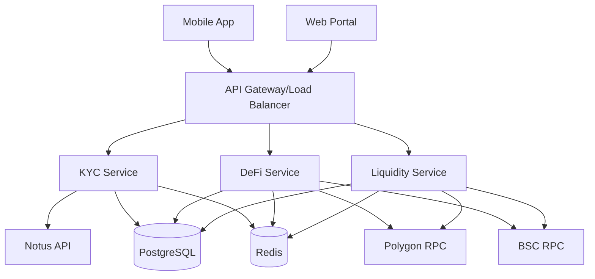

# Arquitetura do Sistema

## Visão Geral

O sistema é uma carteira de criptomoedas com suporte a KYC via WhatsApp, operações DeFi e monitoramento em tempo real. A arquitetura é baseada em microserviços, seguindo os princípios de Domain-Driven Design (DDD) e Clean Architecture.

## Componentes Principais

### 1. Serviço de KYC
- **Responsabilidade**: Gerenciamento de identidade e conformidade
- **Funcionalidades**:
  - Processo de KYC via WhatsApp
  - Verificação de documentos
  - Gerenciamento de limites por nível
- **Tecnologias**:
  - Node.js/TypeScript
  - PostgreSQL
  - Redis (cache)
  - Notus API (WhatsApp)

### 2. Serviço DeFi
- **Responsabilidade**: Operações com carteiras e swaps
- **Funcionalidades**:
  - Criação e gerenciamento de carteiras
  - Transferências
  - Swaps entre tokens
- **Tecnologias**:
  - Node.js/TypeScript
  - PostgreSQL
  - Redis (cache)
  - Web3.js/Ethers.js

### 3. Serviço de Liquidez
- **Responsabilidade**: Gerenciamento de pools de liquidez
- **Funcionalidades**:
  - Adição/remoção de liquidez
  - Monitoramento de APY
  - Alertas via WhatsApp
- **Tecnologias**:
  - Node.js/TypeScript
  - PostgreSQL
  - Redis (cache)
  - Web3.js/Ethers.js

## Camadas da Arquitetura

### 1. API Layer
- Controllers
- Middlewares
- Validação de entrada
- Rate limiting
- Autenticação/Autorização

### 2. Application Layer
- Use cases
- Orquestração de serviços
- Transações
- Eventos

### 3. Domain Layer
- Entidades
- Value objects
- Regras de negócio
- Interfaces de repositório

### 4. Infrastructure Layer
- Implementações de repositório
- Integrações externas
- Cache
- Mensageria

## Segurança

### Autenticação
1. **2FA via WhatsApp**
   - Código de 6 dígitos
   - Tempo de vida de 5 minutos
   - Máximo de 5 tentativas

2. **JWT**
   - Tempo de vida de 24 horas
   - Refresh token com 7 dias
   - Revogação por sessão

### Criptografia
1. **Chaves Privadas**
   - AES-256-GCM
   - Chave mestra por ambiente
   - Salt único por usuário

2. **Dados Sensíveis**
   - Criptografia em repouso
   - TLS 1.3 em trânsito
   - Mascaramento de logs

### Rate Limiting
1. **Por IP**
   - 100 req/min global
   - 1000 req/hora por IP

2. **Por Usuário**
   - Baseado no nível KYC
   - Limites por operação
   - Janela deslizante

## Monitoramento

### Métricas
1. **Performance**
   - Latência de API
   - Tempo de resposta blockchain
   - Taxa de sucesso de transações

2. **Negócio**
   - Taxa de conversão KYC
   - Volume de transações
   - APY médio

### Alertas
1. **Operacionais**
   - Falhas de serviço
   - Latência alta
   - Erros de integração

2. **Negócio**
   - Mudanças significativas de APY
   - Transações grandes
   - Falhas de KYC

## Escalabilidade

### Horizontal
1. **Serviços**
   - Auto-scaling baseado em CPU/memória
   - Mínimo de 3 instâncias por serviço
   - Health checks para remoção de instâncias

2. **Banco de Dados**
   - Réplicas de leitura
   - Sharding por usuário
   - Cache em múltiplas camadas

### Cache
1. **Redis**
   - Cluster com 3+ nós
   - Persistência AOF
   - Políticas de evicção

2. **Estratégia**
   - Cache-aside
   - Write-through
   - TTL baseado em volatilidade

## Integração Blockchain

### Redes Suportadas
1. **Fase 1**
   - Polygon
   - BSC

2. **Fase 2**
   - Ethereum
   - Arbitrum

### Monitoramento de Transações
1. **Confirmações**
   - Polygon: 20 blocos
   - BSC: 15 blocos

2. **Retry**
   - Máximo de 3 tentativas
   - Backoff exponencial
   - Notificação em caso de falha

## Deployment

### Ambientes
1. **Desenvolvimento**
   - Local com Docker Compose
   - Mocks para serviços externos
   - Hot reload

2. **Staging**
   - AWS ECS
   - Réplica de produção
   - Dados sintéticos

3. **Produção**
   - AWS ECS
   - Multi-AZ
   - Auto-scaling

### CI/CD
1. **Pipeline**
   - Lint e testes
   - Build de imagens
   - Análise de segurança
   - Deploy automático

2. **Monitoramento**
   - Métricas de deploy
   - Rollback automático
   - Alertas de falha

## Considerações de Produção

### Backup
1. **Banco de Dados**
   - Backup completo diário
   - WAL contínuo
   - Retenção de 30 dias

2. **Chaves**
   - HSM para chaves mestras
   - Backup offline
   - Rotação periódica

### Disaster Recovery
1. **RTO/RPO**
   - RTO: 1 hora
   - RPO: 5 minutos

2. **Procedimentos**
   - Failover automático
   - Runbooks documentados
   - Testes periódicos

### Compliance
1. **Auditoria**
   - Log de todas as operações
   - Trilha de auditoria
   - Retenção conforme regulação

2. **Privacidade**
   - LGPD/GDPR
   - Criptografia
   - Anonimização
